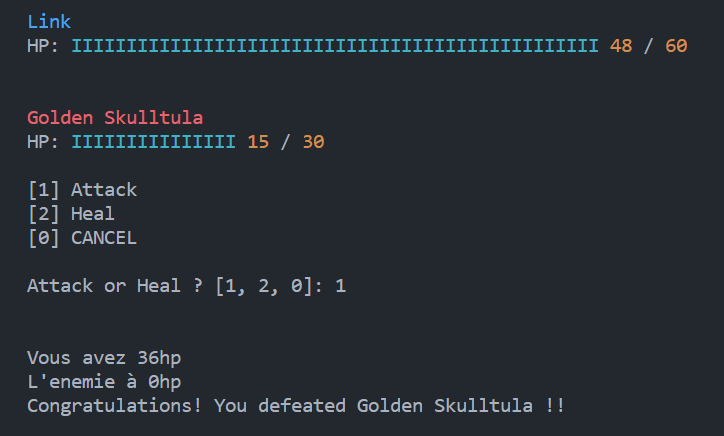

# The Hyrule Castle

Jeu de combat tour par tour en Bash, mettant en scène des affrontements entre des personnages avec gestion des points de vie, attaques et logique de jeu en ligne de commande.

 

## 🧠 Description du fonctionnement

Le jeu repose sur un système de combat simple:

Chaque monstre possède:
- ❤️ des points de vie (HP)
- ⚔️ des attaques avec des dégâts variables
  
Le combat se déroule en tour par tour.
À chaque tour :
- le joueur choisit une action (attaque, soin, etc.)
- l’adversaire joue ensuite (scripté)
  
Le combat continue jusqu’à ce qu’un des deux personnages tombe à 0 HP

## ⚙️ Implémentation en Bash

Le jeu est entièrement développé en Bash et utilise:

- des variables pour stocker la vie et les dégâts
- des conditions (if) pour gérer les actions
- des boucles (while) pour le déroulement du combat
- des fonctions pour organiser le code
read pour les entrées utilisateur

## 🔁 Exemple de déroulement
Le jeu démarre.
Le joueur choisit une option:
- Attaque ⚡
- Soin ❤️
  
L’adversaire attaque et les points de vie sont mis à jour.
Le jeu affiche l’état du combat.
On recommence jusqu’à la victoire ou la défaite
